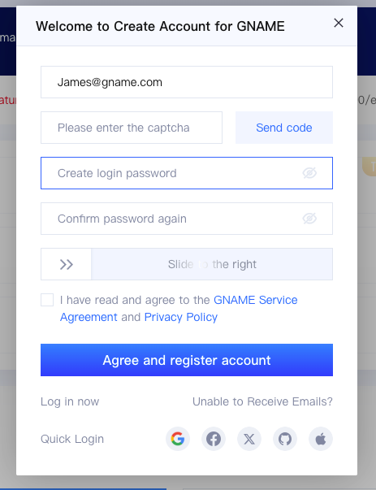
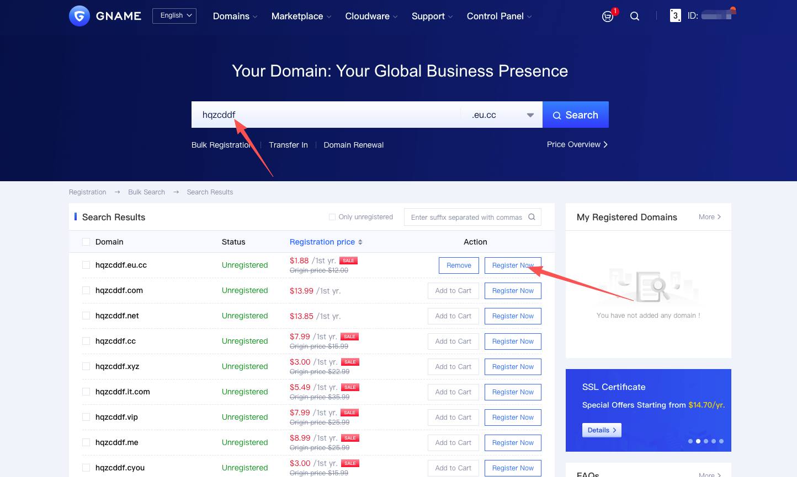
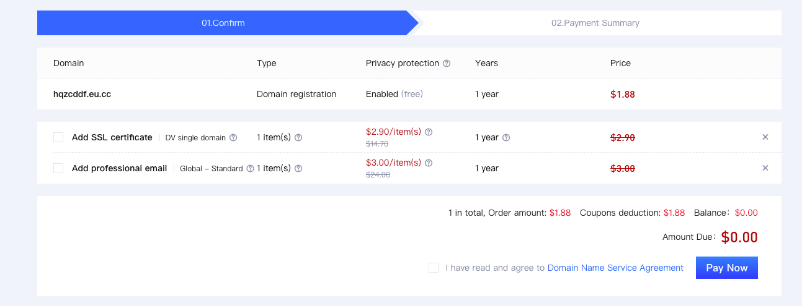
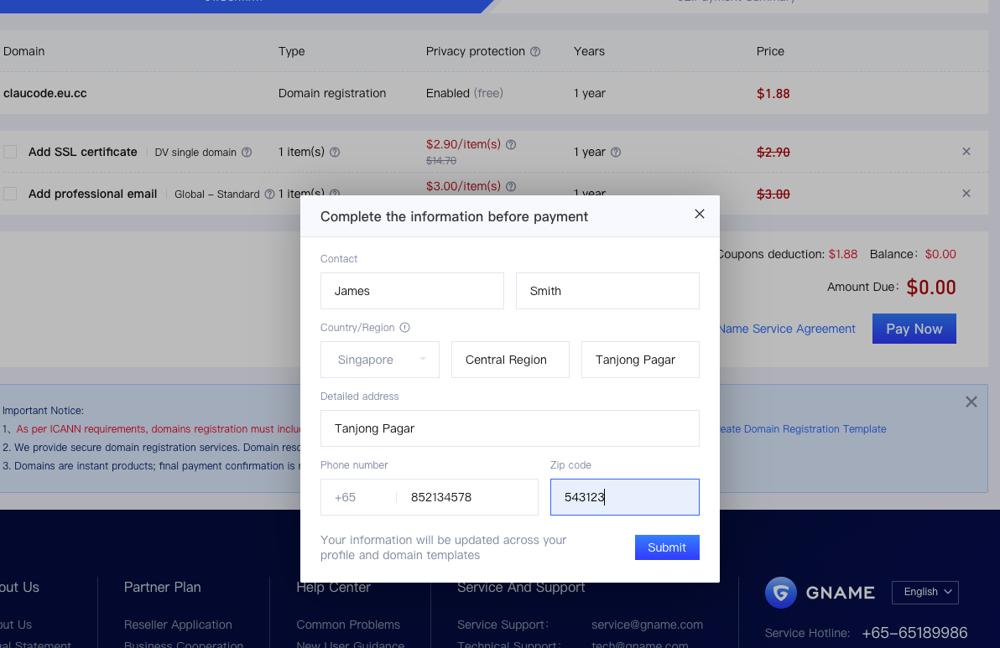
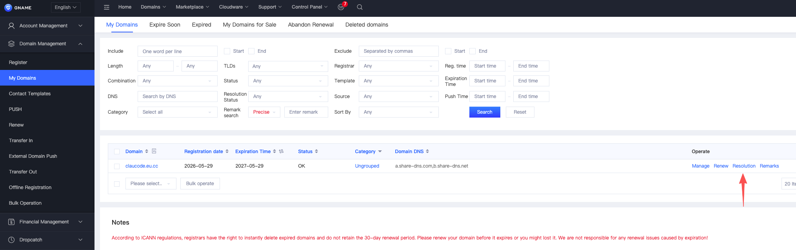
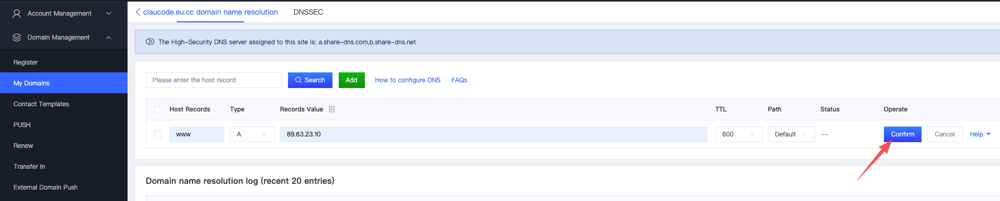
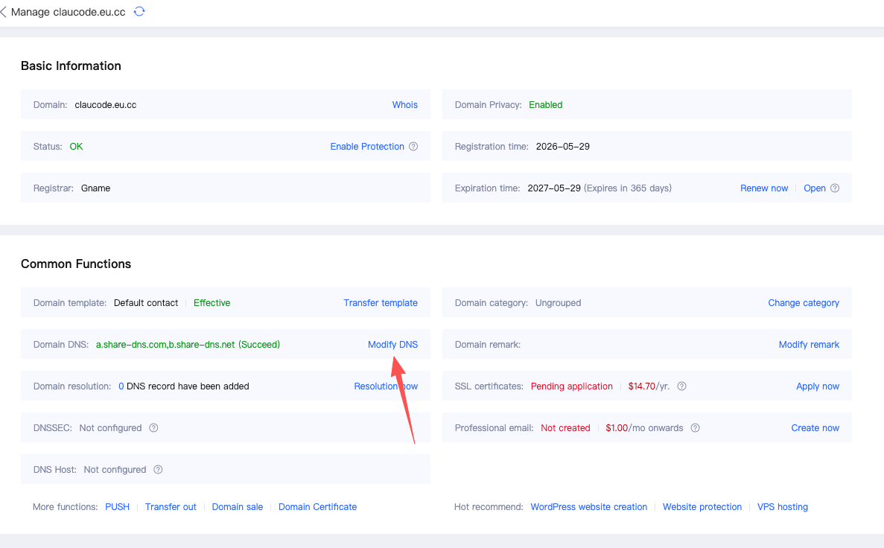
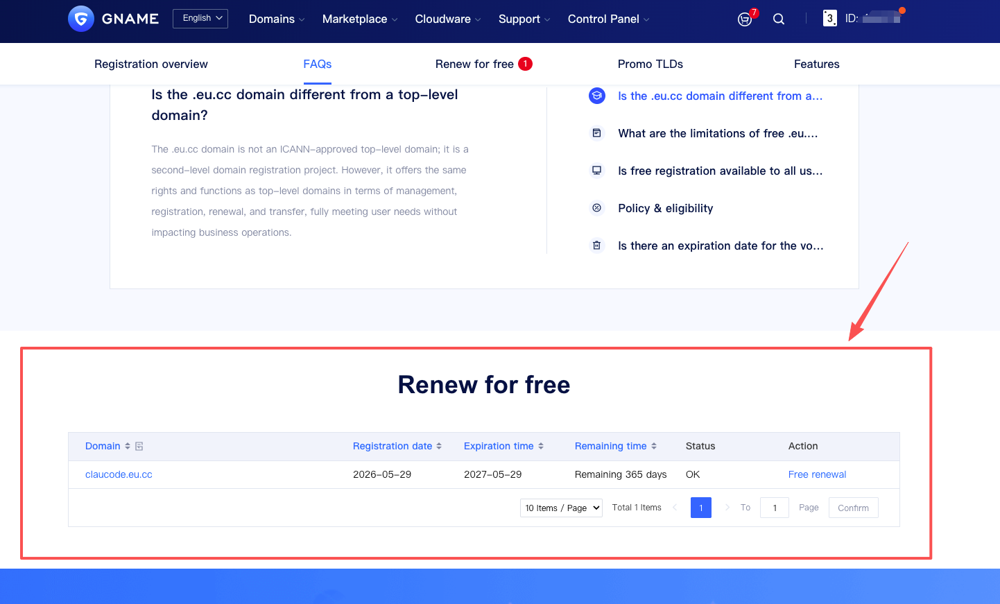

# GNAME 注册【免费域名】新手指南
## 1、注册GNAME账号
访问 **www.gname.com**，点击导航栏注册按钮，可通过邮箱、第三方账号（Facebook、Github等）注册GNAME账号。

## 2、搜索免费域名

打开免费域名注册页面 **https://www.gname.com/zhcn/tld-eu-cc.html**

输入您想要注册的域名，点击搜索域名，在搜索结果中找到您心仪的域名
>【温馨提示】
> 
> 每个新用户可获得 **3张免费注册劵**，在结算时将会自动抵扣 🎉🎉🎉🎉🎉🎉
> 
>对于溢价域名可能需要额外支付费用，溢价域名包括但不限于：2个字母 (如AA.eu.cc、BB.eu.cc)、3个字母 (如ABC.eu.cc、XYZ.eu.cc) 以及品牌词 (如知名企业名称、热门行业词汇)

**首次注册需要完善资料**

支付成功后即可注册成功。

## 3、域名解析
GNAME 提供免费的DNS服务器，您可以在后台 -> 我的域名中添加解析

您也可以使用第三方DNS服务，点击Manage修改DNS服务器，如CloudFlare等

➡️ **[点此进入域名管理面板 >>](https://www.gname.com/user#/admin_ym)**

**修改DNS服务器**

## 4、免费续费
> 【温馨提示】
>
> 域名需在到期90天内，才可在“免费续费”列表中提交免费续费申请。
> 
> 仅在“免费注册”活动页面支持提交免费续费，在我的域名列表或开启自动续费等其他相关页面，均无法享受免费续费活动。
> 
> 溢价域名暂不支持免费续费，实际续费价格要以查询结果为准，像2个字母（如AA.eu.cc、BB.eu.cc）、3个字母（如ABC.eu.cc、XYZ.eu.cc）以及品牌词（如知名企业名称、热门行业词汇）等属于溢价域名范畴。

免费续费活动页面：https://www.gname.com/zhcn/tld-eu-cc.html  ➡️ [点击进入](https://www.gname.com/zhcn/tld-eu-cc.html)

